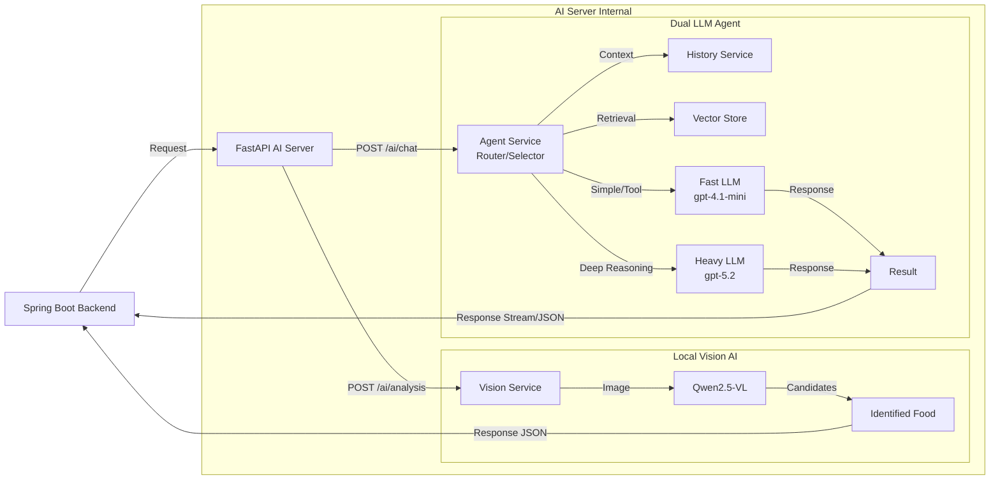

# Match-Meal AI Server 🤖

Match-Meal 프로젝트의 AI 마이크로서비스입니다.
FastAPI를 기반으로 구축되었으며, **On-Device Vision Model(Qwen2.5-VL)** 을 통한 음식 이미지 분류와 **Dual LLM Strategy(GPT-4.1/5.2)** 를 활용한 다목적 영양 컨설팅 기능을 제공합니다.

## 🛠 Tech Stack

### Core Framework

* **Python**: 3.10+
* **FastAPI**: 고성능 비동기 웹 프레임워크.
* **Uvicorn**: ASGI 웹 서버.
* **Pydantic**: 데이터 검증 및 DTO 관리 (`schemas/dtos.py`).

### Visual AI (Local Inference)

* **PyTorch**: 딥러닝 프레임워크 (CUDA/MPS 가속 지원).
* **Transformers**: Hugging Face 라이브러리.
* **Qwen2.5-VL-2B-Instruct**: 이미지 내 음식의 특징을 분석하여 메뉴명을 추론하는 Vision-Language Model.

### Advisory AI (Hybrid LLM)

* **OpenAI API**: 상황에 따라 모델을 스위칭하는 이원화 전략 적용.
* **Fast LLM (`gpt-4.1-mini`)**: 메뉴 추천, 일반 대화, 도구 선택 담당 (Low Latency).
* **Heavy LLM (`gpt-5.2`)**: 기간별 식단 피드백, 식단 계획 수립 등 심층 추론 담당 (High Reasoning).


* **LangChain**: 에이전트(`services/agent.py`) 및 툴 관리.
* **Vector Store**: RAG(검색 증강 생성)를 위한 데이터 저장소 (`services/vector_store.py`).

---

## 🧠 AI Architecture

백엔드 요청의 목적에 따라 Vision 서비스와 Advisory(상담) 서비스로 라우팅되며, 상담 서비스는 **Agent**가 작업의 복잡도에 따라 적절한 도구와 모델을 선택합니다.



---

## 💡 Key Features

### 1. 음식 이미지 식별 (`services/vision_service.py`)

* **Qwen2.5-VL 모델 활용**: 자체 서버에서 구동되는 Vision-Language Model을 통해 음식 이미지를 분석합니다.
* **후보군 제공**: 이미지의 시각적 특징을 분석하여 **1순위 후보(Best Candidate)** 와 **유사 후보군(Candidates)** 을 함께 반환하여 정확도를 보완합니다.

### 2. 지능형 에이전트 상담 (`services/agent.py`)

* **Tool Selector**: 사용자의 질문 의도를 파악하여 검색, 계산, 추천 등 필요한 **도구(Tool)** 를 자동으로 선택합니다.
* **RAG (Retrieval-Augmented Generation)**: `vector_store.py`를 통해 영양학 지식을 검색하여 전문적인 답변을 생성합니다.
* **Dual LLM 전략**:
* 단순 대화 및 도구 호출은 **Fast LLM**이 처리하여 속도를 높입니다.
* 복잡한 식단 계획 및 분석은 **Heavy LLM**이 처리하여 깊이 있는 통찰을 제공합니다.


### 3. 상황별 맞춤 기능 (`services/tools.py`)

* **메뉴 추천**: 사용자의 프로필(BMI, 알레르기)과 현재 영양 상태를 고려한 메뉴 제안.
* **기간별 피드백**: 주간/월간 섭취 기록을 분석하여 영양 불균형 개선점 도출.
* **식단 계획**: 사용자의 목표에 맞춘 구체적인 식단표 생성.

---

## 🔌 API Endpoints

### 1. 음식 분석 (`POST /ai/analysis`)

업로드된 이미지를 분석하여 음식명을 식별합니다. (매핑: `routers/vision.py`)

* **Request**: `multipart/form-data` (File: `image`)
* **Response**:

```json
{
  "candidates": ["김치찌개", "부대찌개", "김치찜"],
  "best_candidate": "김치찌개"
}

```

### 2. 챗봇/에이전트 상담 (`POST /ai/chat/message`)

사용자와의 대화 및 요청을 처리합니다. (매핑: `api/endpoints/chat.py`)

* **Request Body**:

```json
{
  "history": [{"role": "user", "content": "안녕"}],
  "message": "살 빼려면 뭐 먹어야 해?",
  "persona": "friend"
}

```

---

## 📂 Project Structure

```text
.
├── app/                        # Application Source Code
│   ├── main.py                 # FastAPI 앱 진입점 및 설정
│   ├── api/                    # API Endpoints
│   │   └── endpoints/          # (chat.py 등)
│   ├── core/                   # 핵심 설정 (AI Model, DB, Standards)
│   ├── models/                 # DB Entities & Data Models (history.py)
│   ├── routers/                # API Routers (vision.py)
│   ├── schemas/                # Pydantic DTOs (dtos.py)
│   └── services/               # Business Logic
│       ├── agent.py            # LLM 에이전트 메인 로직
│       ├── tool_selector.py    # 도구 선택 로직
│       ├── tools.py            # 실행 가능한 도구 함수들
│       ├── vector_store.py     # RAG 벡터 저장소 로직
│       ├── vision_service.py   # 이미지 분석 서비스
│       └── history_service.py  # 대화 기록 관리
├── models/                     # AI Model Weights (HuggingFace Local Cache)
├── venv/                       # Python Virtual Environment
├── .env                        # Environment Variables
└── requirements.txt            # Dependencies

```

---

## 🚀 Getting Started

### Prerequisites

* Python 3.10 이상
* **GPU 권장**: NVIDIA GPU (VRAM 8GB+) 또는 Apple Silicon (M1/M2/M3)
* **OpenAI API Key**

### Environment Setup (`.env`)

프로젝트 루트에 `.env` 파일을 생성하고 아래 내용을 입력하세요.

```properties
# OpenAI API Configuration
OPENAI_API_KEY=sk-your-openai-api-key
OPENAI_API_BASE=https://api.openai.com/v1  # Optional

# Database
RDS_USERNAME=
RDS_PASSWORD=

```

### Installation & Run

```bash
# 1. 가상환경 생성 및 활성화
python -m venv venv
source venv/bin/activate  # Windows: venv\Scripts\activate

# 2. 의존성 설치
pip install -r requirements.txt

# 3. 서버 실행 (Auto Reload)
uvicorn app.main:app --reload

```